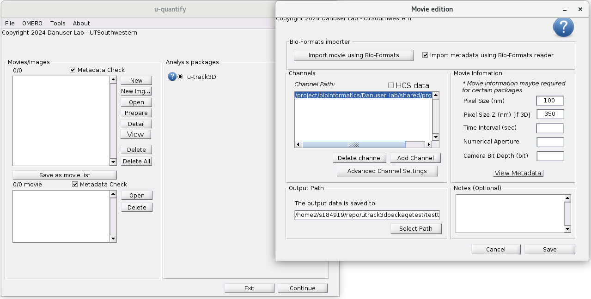
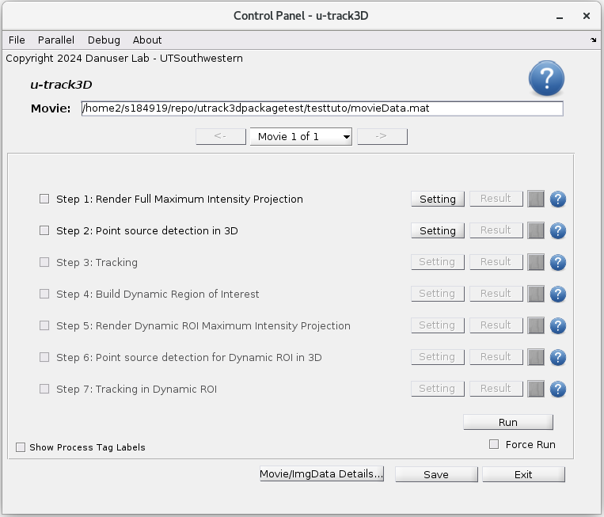

# Table of Contents

1.  [Accessing the code and example dataset](#org1d179c8)
2.  [Script tutorial](#org420e003)
3.  [GUI walk-through (Beta version)](#org7cf0355)
    1.  [Getting started and loading data](#orgfc22fb2)
    2.  [Detection, tracking and review on the whole volumetric sequence](#orgedb8968)
    3.  [Definition of DynROI and tracking in DynROI](#org7365323)
4.  [Known issues](#orga1449e9)
5.  [Milestones](#orgc396f96)
6.  [Requirements](#org5f9ce5d)

# Accessing the code and example dataset

Download the code:

    git clone https://github.com/DanuserLab/u-track3D.git

Download the example dataset:

[Breast cancer cells imaged with diaSLM (Dean et. al. 2016) expressing eGFP-labelled alpha subunit of the AP-2 complex (cropped and limited to 50 time point, 540MB).](https://cloud.biohpc.swmed.edu/index.php/s/4gNCzmayPLdbw9s)

# Script tutorial

Scripting is generally recommended for the analysis of a large number of acquisition due to its flexibility and automated rendering capabilities. The scripting library also provides a larger array of rendering approaches than the GUI version:

-   Fully automated mipping overlay and video production
-   Amira export of detection and tracking
-   Point cloud rendering for faster display of detection mask

After cloning the repo and adding the code folder path to Matlab, you will find the tutorial script at:

    trackingEndocyticPits_tutoscript.m

Prepare the script as follows: 

-   Adjust parpool(20) with the number of parallelizable core on your maching
-   Adjust <fullpath1> to the raw data folder name
-   Adjust <path1> to your output folder name

Follow the script comments for instructions on parameterization and visualization. 

# GUI walk-through (Beta version)

The GUI is generally recommended for the analysis of a couple files and test the capacity of u-track 3D on a given type of dataset. With straightforward data loading and a simplified execution pipeline, the GUI is designed toward an intuitive first experience. 

## Getting started and loading data

Create a parallel pool for parallel computing in matlab using either the [command line or the graphical interface](https://www.mathworks.com/help/parallel-computing/parpool.html). Add the code folder in Matlab path. Then launch the GUI in the command line with: 

    movieSelectorGUI()

Then click "new" to create a new movie

If the data follows the bioformat standard, then open "Import Movie using Bioformat " and  select  the file, or first file of a sequence. If not, the format must be in a single tiff file per time point and each channel must be placed in a single folder. Use the "add channel" dialog to point to each channel folder

Then launch the "New U-track 3D" application. 

In order to keep the set of operation linear, u-track 3D is organized in seven processes:

1.  Maximum Intensity Projection (MIP) rendering
2.  Detection on the full volume
3.  Tracking on the full volume
4.  Definition of a Dynamic Region Of Interest (DynROI)
5.  Maximum Intensity Projection (MIP) rendering in the DynROI
6.  Detection in the DynROI
7.  Tracking in the DynROI

## Detection, tracking and review on the whole volumetric sequence

Each process must parameterized or "setup" before being run. Sometime it merely involves opening the setup dialog and accepting the defaults by clicking "apply", as for example below with the MIP rendering process in the case of a single channel. This step ensures that the users explore the capacity the algorithm to adapt to their datasets.

The detection parameters propose different algorithms for detection, the default approach being the one presented in the u-track 3D paper. In this beta version, the "Scales" dialog define the scales used for filtering and the Alpha value define sensitivity. Further  improvement will be made to separate different type of algorithms. 

Click "Apply" and then "Run" in the control pannel to run the first two processes, then review the results by clicking on "Results"  in step 2. Results can be seen overlayed over a MIP:

Or by slicing the volume 

The parameterization of the tracking algorithm first provides control over the maximum gap size, the minimum track size to be considered among other several controls.

The control of Frame-to-frame linking and gap closing is performered in separated views:

Once tracks are computed ("Apply" parameter and click on "run"), trajectories can be reviewed similarly to the review of detections. 

## Definition of DynROI and tracking in DynROI

The estimation of trajectories open the door to the dynROI in step 4. Several variation of dynROI estimation are made available such as: 

-   **fitTrackSetFrameByFrame**: fit an optimal box following a group of tracks over time. Motions are estimated on a frame-by-frame basis, ideal when the structural changes are important over time, but local changes are smooth over a few frames.
-   **fitTrackSetRegistered**: fit an optimal box following a group of tracks over time. Motion are estimated with respect to the first frame, ideal when the structural changes are slow overtime but the local motions measured in the trajectories are highly stochastic.
-   **fitDetSetFrameByFrame**: same as "fitTrackSetFrameByFrame" using detection instead of tracks.
-   **fitDetSetRegister**: same as "fitTrackSetRegistered" using detection instead of tracks.

More dynROI types will be made available and documented in the near future. 

The review of dynROI location can be carried out using the MIP view in the Results panel: 

The voxels described by the dynROI can then be displayed by toggling on the "Dynamic ROI Raw Image" dialog. Here is a gif produced through the "save frames" dialog: 

The last three remaining process 5 to 7 behave similarly to step 1 to 3, except that the dynROI built must be specified for the process to run properly using the "Build Dynamic ROI Process" drop-down menu as shown below for the detection process: 

and for tracking process:

# Known issues

-   The set of parameters for detection is confusing. Further streamlining improvement will be made for a smaller set of parameters to be visible.

# Milestones

-   Adding Amira trajectory export in addition to detection in example script
-   Add an example of script-based Biofomart import
-   Demonstrate trackability in the script
-   Augmenting Script comments
-   Adding more types of DynROI in the GUI
-   Fix annoying requirement in the GUI work flow (cf. Known Issues)

# Requirements

-   This software require the following Matlab licences
    -   Matlab 2015a to 2019b
    -   Computer Vision Toolbox
    -   Image Processing Toolbox

-   This software with this test dataset has been tested the following setups
    -   Linux Red Hat 7
    -   Matlab 2015a to 2019b
    -   32Gb of memory
    -   Intel(R) Xeon(R) CPU E5-2680 v4 @ 2.40GHz

