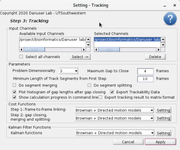

# Table of Contents

1.  [Associated paper](#org85621ee)
2.  [Accessing the code and example dataset](#org8753984)
3.  [Script usage](#org61356ca)
4.  [Reproducing the u-track 3D paper with the tutorial scripts](#orga9df050)
5.  [Performances](#orgf7f5dd7)
6.  [GUI walk-through (Beta version)](#org35c09af)
    1.  [Getting started and loading data](#org093ae98)
    2.  [Detection, tracking and review on the whole volumetric sequence](#orgd52b83a)
    3.  [Definition of DynROI and tracking in DynROI](#org47ef5ca)
7.  [Known issues](#org2e8674d)
8.  [Milestones](#orgb3ec9c0)
9.  [Software Requirements](#org2196469)

# Associated paper

U-track 3D tackles on-going challenges in the interpretation and quantitative analysis of large arrangements of 3D trajectories as it arises with the measurement of intracellular dynamics with light-sheet micoscopy. The software is associated to the following publication currently under review. 

[Roudot, Philippe, Wesley R Legant, Qiongjing Zou, Kevin M Dean, Erik S Welf, Ana F David, Daniel W Gerlich, Reto Fiolka, Eric Betzig, and Gaudenz Danuser. "U-Track 3D: Measuring and Interrogating Intracellular Dynamics in Three Dimensions". BioRxiv.  https://doi.org/10.1101/2020.11.30.404814.](//select/items/1_ZI5GQH6G)

# Accessing the code and example dataset

Download the code:

    git clone https://github.com/DanuserLab/u-track3D.git

Download the example datasets:

[Endocytosis dataset](https://cloud.biohpc.swmed.edu/index.php/s/4gNCzmayPLdbw9s): Breast cancer cells  expressing eGFP-labelled alpha subunit of the AP-2 complex imaged with diaSLM by K. Dean (Dean et. al. 2016). The raw data has been cropped and limited to 50 time point (540MB).

[Mitosis dataset](https://cloud.biohpc.swmed.edu/index.php/s/5eceFNPcPB4iosa): HeLa cells undergoing mitosis and expressing eGFP-labeled EB3 and mCherry-labeled CENPA imaged in dual-channel lattice light-sheet microscopy by W. Legant (David et. al. 2019). The raw data has been cropped, the entire sequence has been made available. 

# Script usage

Scripting is generally recommended for the analysis of a large number of acquisitions due to its flexibility and automated rendering capabilities. At the moment, the scripting library also provides more features than the GUI: 

-   A larger set of dynROIs are available
-   Trackability computations
-   Fully automated mipping overlay and video production
-   Amira export of detection and tracking
-   Point cloud rendering for faster display of detection mask

After cloning the repo and adding the code folder path to Matlab, you will find the following tutorial script in the repository:

    tutoscript/trackingEndocyticPits_visualLibraryDemo.m

This script follows the sequence of processes possible in the GUI with additional visualization approaches: 

-   Detection and tracking on the full datasets
-   Generate a dynROI following a set of trajectories
-   Detection and tracking inside the dynROI
-   Rendering results on MIP
-   Exporting to Amira
-   Point cloud rendering

**Example dataset**: Endocytosis dataset

    tutoscript/trackingEndocyticPits_trackability.m

This script is a variation of the former to demonstrate manual dynROI selection and trackability: 

-   Detection and tracking on the full dataset
-   Generate a dynROI from a set of trajectories
-   Selecting manually a ROI within the DynROI
-   Detection and tracking inside the manual  dynROI
-   Compute trackability in the manual dynROI
-   Rendering results on MIP

**Example dataset**: Endocytosis dataset

    tutoscript/trackingKFiberDynROI.m

This script demonstrates how to built a custom dynROI following two trajectories: 

-   Detection and tracking on the full dataset
-   Generate a conical dynROI from a pair of trajectories
-   Detection inside the custom dynROI
-   Visualizaton and statistics

**Example dataset**: Mitosis datasets

The minimum configuration for each script includes: 

-   Adjusting parpool(#) with # the number of parallelizable core on your machine
-   Adjusting <fullpath#> to the raw data folder name with # reflecting the number of channels
-   Adjusting <analysisRoot> to your output folder name

# Reproducing the u-track 3D paper with the tutorial scripts

The scripts reproduce the majority of features used in numerical experiments presented in the u-track 3D paper. Because of the large size of the datasets used in the paper, the script operates on smaller datasets that are amenable to direct download by the community. Here is the detail of the features that are demonstrated, their associated figures in the paper, and the script that reproduces them. One script can demonstrate several feature with a same dataset:

<table border="2" cellspacing="0" cellpadding="6" rules="groups" frame="hsides">

<colgroup>
<col  class="org-left" />

<col  class="org-left" />

<col  class="org-left" />
</colgroup>
<thead>
<tr>
<th scope="col" class="org-left">Feature</th>
<th scope="col" class="org-left">Figure</th>
<th scope="col" class="org-left">Script</th>
</tr>
</thead>

<tbody>
<tr>
<td class="org-left">Tracking Brownian motions described by endocytic events</td>
<td class="org-left">Fig1.a</td>
<td class="org-left">trackingEndocyticPits_visualLibraryDemo</td>
</tr>

<tr>
<td class="org-left">Multiscale Detections (Pole, KT, plus-ends)</td>
<td class="org-left">Fig2.f-m</td>
<td class="org-left">trackingKFiberDynROI</td>
</tr>

<tr>
<td class="org-left">Building dynROI around tracks</td>
<td class="org-left">Fig2.a</td>
<td class="org-left">trackingEndocyticPits_visualLibraryDemo</td>
</tr>

<tr>
<td class="org-left">Building conical dynROI between MT Poles and Chromosomes</td>
<td class="org-left">Fig2.j</td>
<td class="org-left">trackingKFiberDynROI</td>
</tr>

<tr>
<td class="org-left">Building Manual ROI nested in a dynROI</td>
<td class="org-left">Fig3.f</td>
<td class="org-left">trackingEndocyticPits_trackability</td>
</tr>

<tr>
<td class="org-left">Detection restricted to a dynROI</td>
<td class="org-left">Fig2.k-m</td>
<td class="org-left">trackingKFiberDynROI</td>
</tr>

<tr>
<td class="org-left">Tracking restricted to a dynROI</td>
<td class="org-left">Fig3.f</td>
<td class="org-left">trackingEndocyticPits_visualLibraryDemo</td>
</tr>

<tr>
<td class="org-left">Trackability</td>
<td class="org-left">Fig3.f-g</td>
<td class="org-left">trackingEndocyticPits_trackability</td>
</tr>
</tbody>
</table>

Here is a list of the measurements that  cannot be reproduced with those scripts and datasets due to the size of the associated datasets: 

-   Enocytic events lifetime analysis on on Breast Cancer Cell imaging (Fig1.b,c)
-   Microtubule instability response to biochemical inhibition (Fig1.e,g).
-   Adhesion shape studies (Fig2.a-d).
-   Interpolar plane estimation from prometaphase to metaphase (Fig 2.f-i.)
-   Trackability in the complete volume of the Breast cancer-cell, a crop of this dataset is however provided (Fig3.f-h)

Scripts to be released

-   Tracking SOX2 single molecule with lattice light-sheet microscopy.
-   Tracking microtubule dynamic instability

# Performances

The software is CPU-optimized and has been tested on the following machines. 

<table border="2" cellspacing="0" cellpadding="6" rules="groups" frame="hsides">

<colgroup>
<col  class="org-left" />

<col  class="org-left" />

<col  class="org-left" />

<col  class="org-right" />
</colgroup>
<thead>
<tr>
<th scope="col" class="org-left">Computer main features</th>
<th scope="col" class="org-left">OS</th>
<th scope="col" class="org-left">script</th>
<th scope="col" class="org-right">Time (s)</th>
</tr>
</thead>

<tbody>
<tr>
<td class="org-left">Intel Xeon E5-2680 28 cores @ 2.4 GHz - 528 GB Ram</td>
<td class="org-left">Linux</td>
<td class="org-left">trackingEndocyticPits_visualLibraryDemo (incl. rendering)</td>
<td class="org-right">142</td>
</tr>

<tr>
<td class="org-left">Intel Xeon E5-2680 16 cores @ 2.7 GHz - 32 GB Ram</td>
<td class="org-left">Linux</td>
<td class="org-left">trackingEndocyticPits_visualLibraryDemo (incl. rendering)</td>
<td class="org-right">206</td>
</tr>
</tbody>
</table>

# GUI walk-through (Beta version)

The GUI is generally recommended for the analysis of a couple files and test the capacity of u-track 3D on a given type of dataset. With straightforward data loading and a simplified execution pipeline, the GUI is designed toward an intuitive first experience. 

## Getting started and loading data

Create a parallel pool for parallel computing in matlab using either the [command line or the graphical interface](https://www.mathworks.com/help/parallel-computing/parpool.html). Add the code folder in Matlab path. Then launch the GUI in the command line with: 

    movieSelectorGUI()

Then click "new" to create a new movie

If the data follows the bioformat standard, then open "Import Movie using Bioformat " and  select  the file, or first file of a sequence. If not, the format must be in a single tiff file per time point and each channel must be placed in a single folder. Use the "add channel" dialog to point to each channel folder

Then launch the "New U-track 3D" application. 

In order to keep the set of operation linear, u-track 3D is organized in seven processes:

1.  Maximum Intensity Projection (MIP) rendering
2.  Detection on the full volume
3.  Tracking on the full volume
4.  Definition of a Dynamic Region Of Interest (DynROI)
5.  Maximum Intensity Projection (MIP) rendering in the DynROI
6.  Detection in the DynROI
7.  Tracking in the DynROI

## Detection, tracking and review on the whole volumetric sequence

Each process must be parameterized or "setup" before being run. Sometime it merely involves opening the setup dialog and accepting the defaults by clicking "apply", as for example below with the MIP rendering process in the case of a single channel. This step ensures that the users explore the capacity the algorithm to adapt the parameters to their datasets.

The detection parameters propose different algorithms for detection, the default approach being the one presented in the u-track 3D paper. In this beta version, the "Scales" dialog define the scales used for filtering and the Alpha value define sensitivity. Further  improvement will be made to separate different type of algorithms. 

Click "Apply" and then "Run" in the control pannel to run the first two processes, then review the results by clicking on "Results"  in step 2. Results can be seen overlayed over a MIP:

Or by slicing the volume 

The parameterization of the tracking algorithm first provides control over the maximum gap size, the minimum track size to be considered among other several controls.

The control of Frame-to-frame linking and gap closing is performered in separated views:

Once tracks are computed ("Apply" parameter and click on "run"), trajectories can be reviewed similarly to the review of detections. 

## Definition of DynROI and tracking in DynROI

The estimation of trajectories open the door to the dynROI in step 4. Several variation of dynROI estimation are made available such as: 

-   **fitTrackSetFrameByFrame**: fit an optimal box following a group of tracks over time. Motions are estimated on a frame-by-frame basis, ideal when the structural changes are important over time, but local changes are smooth over a few frames.
-   **fitTrackSetRegistered**: fit an optimal box following a group of tracks over time. Motion are estimated with respect to the first frame, ideal when the structural changes are slow overtime but the local motions measured in the trajectories are highly stochastic.
-   **fitDetSetFrameByFrame**: same as "fitTrackSetFrameByFrame" using detection instead of tracks.
-   **fitDetSetRegister**: same as "fitTrackSetRegistered" using detection instead of tracks.

More dynROI types will be made available and documented in the near future. 

The review of dynROI location can be carried out using the MIP view in the Results panel: 

The voxels described by the dynROI can then be displayed by toggling on the "Dynamic ROI Raw Image" dialog. Here is a gif produced through the "save frames" dialog: 

The last three remaining process 5 to 7 behave similarly to step 1 to 3, except that the dynROI built must be specified for the process to run properly using the "Build Dynamic ROI Process" drop-down menu as shown below for the detection process: 

and for tracking process:

# Known issues

-   The set of parameters for detection is confusing. Further streamlining improvement will be made for a smaller set of parameters to be visible.
-   Detection and tracking sets used for dynROI estimation must be set manually, even when there is only one option.
-   The Detection set must be selected before the last tracking step. This problem is also being solved.

# Milestones

-   [X] Adding Amira trajectory export in addition to detection in example script
-   [X] Demonstrate trackability in the script
-   [ ] Add an example of script-based Bioformt import
-   [ ] Adding more types of DynROI in the GUI
-   [ ] Fix annoying requirement in the GUI work flow (cf. Known Issues)

# Software Requirements

-   This software requires the following Matlab toolboxes
    -   Matlab 2018a to 2019b
    -   Computer Vision Toolbox
    -   Image Processing Toolbox
    -   Control System Toolbox
    -   Optimization Toolbox
    -   Image Processing Toolbox
    -   Statistics and Machine Learning Toolbox
    -   Curve Fitting Toolbox
    -   Computer Vision Toolbox
    -   Parallel Computing Toolbox

-   This software has been on the following OS
    -   Linux Red Hat 7

